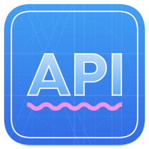

# FunBox API Blueprint tutorial

### Introduction

[API Blueprint](https://apiblueprint.org/) (APIB) is a language for describing client-server
interactions with JSON as data. APIB allows developers to describe the format of server requests,
server responses, URL parameters, and much more.

APIB uses Markdown syntax as a basis. To describe data structures in APIB documentation
[MSON](https://github.com/apiaryio/mson/blob/master/MSON%20Specification.md) syntax is used.
With help of MSON, it is easy to define structures of requests and responses or to define
named types and use them throughout the document.

## Why API Blueprint

We use JSON API widely in the company, so each day our developers face such issues
as describing and approving API documentation, tracking changes, distributing
documentation among partners, and so on. That is why we felt a strong need
for convenient tools to work with documentation.

Historically, the battle was between [API Blueprint](https://apiblueprint.org/)
and [Swagger](https://swagger.io/).
We chose API Blueprint for two reasons. Firstly, the source code of documentation
that is described using API Blueprint is more readable to humans.
Secondly, at the time of research conducted, Swagger lacked several important features,
as `One Of` support.

## APIB tools

In a simple case, to work with APIB documentation you're going to need:

- A text editor — [VS Code](https://code.visualstudio.com/), [Vim](https://www.vim.org/)
or any other. Enabling Markdown syntax highlighting can be useful.
- A tool to render a document to an HTML page.
- A tool to parse APIB documentation. In most cases, a parser is a part of a renderer,
but sometimes you can use it explicitly to build other APIB utilities.

API Blueprint standard is mostly maintained by [Apiary](https://apiary.io/),
which owns the official parser [Drafter](https://github.com/apiaryio/drafter).
Other enthusiasts help to develop some [tools](https://apiblueprint.org/tools.html)
to work with API Blueprint, including renderers.

## FunBox APIB tools

For some time a standard set of tools to work with APIB documentation
had been including [Drafter](https://github.com/apiaryio/drafter) as a parser
and [aglio](https://github.com/danielgtaylor/aglio) as a renderer.

Drafter and aglio had been helping us a lot with documentation but we gradually
started to understand that the functionalities of these tools weren't enough for us.

It turned out, that our desire to bring some improvements to these tools hit a wall
of hesitation and bureaucracy in PRs and conversations. At first, we had been using
forked versions of Drafter and aglio, but then we realized that it takes much more time
than planned.

That's how our company acquired our own set of tools and utilities to work
with APIB documentation. Our implementations are written in plain JavaScript,
so it is easy to maintain with help of only frontend-developers.

---


### [Crafter](https://github.com/funbox/crafter)

**Crafter** is an API Blueprint parser. It was developed as a replacement for the forked
Drafter parser which is written in C++. Our company has a tiny percent of C++ projects,
so almost none of the developers can maintain and improve Drafter.

Compared to Drafter, this library can offer some important features:

- **Modules**. Now it is possible to split one giant file into parts and inject APIB files into each other, which makes documentation easy to use.
- **Resource Prototypes** allow you to set up common responses in one place and reuse them through the documentation.
- Support of **arrays in query strings**.
- **JSON Schema based types**. In case of complex types it is possible to describe them directly as JSON Schema.
- **String validation** attributes that describe the expected length of parameters and regular expressions they should match.
- Describe a **non-HTTP interaction** (as WebSocket) by means of Message section.

Additional information about Crafter you can find in project [README](https://github.com/funbox/crafter/blob/master/README.md).

---


### [Blueprinter](https://github.com/funbox/blueprinter)

**Blueprinter** is an API Blueprint renderer. It uses source `.apib` documentation
to generate API AST in the form of [API Elements](https://apielements.org/) and
create an HTML page with documentation.

Blueprinter advantages:

- **Modern design.** Dark theme included!
- **Search in documentation.** You can use part of URL or a title to find groups, resources or actions, and quickly access them.
- **Print version.** This version removes all unnecessary content and leaves obligatory content in adapted mode.
- **One Of options selector.** Our tool allows you to select different options of
  [One Of](https://apiblueprint.org/documentation/mson/specification.html#52-one-of-type) element and generate response body dynamically.
- **Manual search page.** You may found that the search field is not enough when it comes to finding a part of a description
  or a particular attribute. Manual search page allows you to use standard browser finder to search through text.
- **Information about parsing warnings and errors.** Parsing warnings pop up as a notification. Parsing error which blocks
  page rendering shows up as a separate page with detailed information.

Additional information about Blueprinter you can find in project [README](https://github.com/funbox/blueprinter/blob/master/README.md).

---



### [APIB Language Server](https://github.com/funbox/vscode-apib-ls)

**APIB Language Server** is a VS Code extension that brings a Language Server support for API Blueprint.
It adheres to the [Language Server Protocol](https://github.com/Microsoft/language-server-protocol) and allows
to enhance developer experience when creating and editing API Blueprint documentation in code editors and IDEs.

Supported capabilities

- Syntax highlighting.
- Diagnostic messages.
- Breadcrumbs of documentation sections.
- “Go to definition” implementation for data structures and resource prototypes.
- Autocomplete for types and structure names.

Additional information about how to install and use VS Code plugin you can find
in project [README](https://github.com/funbox/vscode-apib-ls/blob/master/README.md).

---

### [API validator](https://github.com/funbox/api-validator)

**api-validator** is a frontend tool to validate server response against API Blueprint documentation.

To minimize the number of errors on the frontend side associated with incorrect backend responses,
we developed a tool for automatic validation. It extracts JSON schema from the API Blueprint documentation
and allows to automatically check correspondence between the backend response and the documentation for this request.

Additional information about how to use api-validator you can find
in project [README](https://github.com/funbox/api-validator/blob/master/README.md).


## API Blueprint specifications

In general form, an API Blueprint documentation relies on two specifications:

- [API Blueprint Specification](https://apiblueprint.org/documentation/specification.html),
- [MSON Specification](https://apiblueprint.org/documentation/mson/specification.html).

However, during development of our own instruments (Crafter as an example) there have been appearing some fixes
and improvements in functionality which required adding certain enhancements to original specifications.

To keep going with new features, but at the same time have a formal description
of the rules for our innovations, we forked API Blueprint and MSON specifications.

- [our fork of API Blueprint spec](https://github.com/funbox/api-blueprint),
- [our fork of MSON spec](https://github.com/funbox/mson).

In these specifications, you can find out what sections the typical documentation consists of,
and what rules you should follow when you work with the content of API Blueprint documentation.

### Differences between original and forked API Blueprint specification

- Dropped support of Resource model section and Relation section.
- [Resource prototypes][resource-prototypes-section] section definition was added.
This allows you to set up common responses in one place and reuse them through the documentation.
- [Import][import-section] section definition was added.
This allows to implement modular documentation and inject APIB files into each other.
- Definitions of [SubGroup][subgroup-section] and [Message][message-section] sections were added,
definition of the [Group][group-section] section was extended.
This allows to describe non-HTTP interaction in a documentation.
- [Schema Structures][schema-structures-section] section definition was added. This allows to describe complex
data structures directly in JSON Schema format.
- A few other non-significant improvements.

### Differences between original and forked MSON specification

- New type attributes for a string value: format and pattern. See [Type Attribute][mson-type-attribute] section.
These attributes give you more precise control over the value validation within JSON Schema.
- New type attributes for an array value to specify array size: `min-length` and `max-length`.
See [Size Range][mson-size-range] section.
- New type attributes `minimum` and `maximum` for a numeric value to validate a number
against the specified range of values. See [Range Of Numbers][mson-num-range] section.
- Removed definition of the fixed-type attribute for arrays.
- Described opportunity to define description of One Of elements.
- A few other non-significant improvements.

## APIB project setup

First, you need to install Node.js to work with APIB documentation. You can get it from the
[official site](https://nodejs.org/en/), via Homebrew (MacOS X) or a repository (Linux).
Recommended Node.js version is 14.18.0 or higher.

In the root of your APIB project, folder create `package.json` with the next content:

```json
{
  "name": "project-name-apib",
  "version": "1.0.0",
  "description": "API Blueprint documentation for project «Project Name»",
  "scripts": {
    "dev": "npx @funboxteam/blueprinter -i doc.apib -s -p 3000",
    "doc": "npx @funboxteam/blueprinter -i doc.apib -o index.html"
  },
  "dependencies": {
    "@funboxteam/blueprinter": "5.1.0"
  }
}
```

- Use your project name instead of `project-name-apib`. Using `apib` postfix is a general recommendation
for APIB projects.
- Use your product name instead of `Project Name`.
- Specify the [latest vesrion](https://github.com/funbox/blueprinter/blob/master/package.json#L3)
of `@funboxteam/blueprinter` instead of `5.1.0`.

When you're done with `package.json`, run `npm install` to install `@funboxteam/blueprinter`
as a dependency.

## How to write APIB documentation

In your project root folder add the `doc.apib` file with documentation. If you use another file as an entry point,
replace `doc.apib` argument in `dev` and `doc` npm scripts with the corresponding path.
You can split documentation into separate parts and include them in the root file with the `Import` keyword.

### Documentation splitting tips

Our implementation of the `Import` statement sets several restrictions on how the documentation
can be split into parts and how these parts can be imported into each other. 

1. Imported APIB files should contain not just a text but a standalone top-level APIB section
which will be parsed explicitly and could not break the resulted documentation when import order changes.
At this moment, the next sections are regarded as top-level:

    * [Group][group-section],
    * [Resource][resource-section],
    * [Data Structures][data-structures-section],
    * [Schema Structures][schema-structures-section],
    * [Resource Prototypes][resource-prototypes-section],
    * [Import][import-section].

    **Example.** In the past times, we could define a `# Data Structures` section in one file and a `# Users` section
    in another file. Before import rules became more strict semantics of the `# Users` section had been dependent
    on imports order. In one case, it could be parsed as a description, and in other cases, it could be parsed as
    a named data structure. Current version forbids that.

2. If an APIB file uses some named data structures, they should be imported explicitly.
You can not define data structures in a separate file, import them in the root `doc.apib` file,
and then implicitly use them in other imported files.

    **Example.** Let's consider incorrect documentation with implicit usage of data structures:
    ```apib
    # My Doc
 
    # Import data-structures.apib
    # Import resources.apib
    ```
    
    In this case, file `resources.apib` has no idea where used data structures are defined. We assume that
    they should be somewhere. That creates an implicit dependency which resolves in the root file and can cause some
    problems when working with a large documentation.
    To fix this, you need to import data structures in every file which uses these data structures.

    doc.apib:
    ```apib
    # My Doc

    # Import resources.apib
    ```

    resources.apib:
    ```apib
    # Import data-structures.apib

    # GET /user

    + Response 200
      + Attributes (User)
    ```

## Examples

[Examples](https://github.com/funbox/api-blueprint-tutorial/tree/master/examples) folder contains available
examples of common APIB cases.

## Credits

Logos for projects were made by [Igor Garybaldi](https://pandabanda.com/).

[](https://funbox.ru)

[resource-prototypes-section]: https://github.com/funbox/api-blueprint/blob/master/API%20Blueprint%20Specification.md#resource-prototypes-section
[import-section]: https://github.com/funbox/api-blueprint/blob/master/API%20Blueprint%20Specification.md#import-section
[message-section]: https://github.com/funbox/api-blueprint/blob/master/API%20Blueprint%20Specification.md#message-section
[subgroup-section]: https://github.com/funbox/api-blueprint/blob/master/API%20Blueprint%20Specification.md#subgroup-section
[group-section]: https://github.com/funbox/api-blueprint/blob/master/API%20Blueprint%20Specification.md#group-section
[resource-section]: https://github.com/funbox/api-blueprint/blob/master/API%20Blueprint%20Specification.md#resource-section
[schema-structures-section]: https://github.com/funbox/api-blueprint/blob/master/API%20Blueprint%20Specification.md#def-schema-structures
[data-structures-section]: https://github.com/funbox/api-blueprint/blob/master/API%20Blueprint%20Specification.md#data-structures-section

[mson-type-attribute]: https://github.com/funbox/mson/blob/master/MSON%20Specification.md#353-type-attribute
[mson-size-range]: https://github.com/funbox/mson/blob/master/MSON%20Specification.md#3533-size-range
[mson-num-range]: https://github.com/funbox/mson/blob/master/MSON%20Specification.md#3534-range-of-numbers
[mson-one-of-type]: https://github.com/funbox/mson/blob/master/MSON%20Specification.md#52-one-of-type
