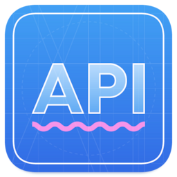

# FunBox API Blueprint Tutorial

### Введение

[API Blueprint](https://apiblueprint.org/), или APIB, — язык для описания
взаимодействия между клиентом и сервером, которые используют JSON для передачи
данных. APIB позволяет документировать доступные запросы к серверу и их формат,
доступные ответы сервера и их формат, а также параметры URL.

APIB основан на языке разметки Markdown. Структуры данных внутри документации APIB описываются
на языке разметки [MSON](https://github.com/apiaryio/mson/blob/master/MSON%20Specification.md).
С помощью MSON можно непосредственно задать структуру запросов и ответов или объявить именованные
типы данных для дальнейшего описания запросов и ответов.

### Почему API Blueprint

Множество компаний по всему миру используют JSON API в проектах, и мы не исключение.
Формальное описание API необходимо, чтобы поддерживать и развивать проект, над которым работает большая команда.
Таким образом, в нашей компании неизбежно возникла необходимость в удобном формате и средствах для работы с документацией.

Исторически в компании происходил выбор между [API Blueprint](https://apiblueprint.org/)
и [Swagger](https://swagger.io/). Мы выбрали API Blueprint по двум причинам.
Во-первых, исходный код документации, описанной с помощью API Blueprint, проще воспринимается 
человеком. Во-вторых, на момент исследования в Swagger не хватало ряда важных возможностей,
например `One Of`.

## Инструменты для работы с APIB

Для того чтобы начать работать с APIB-документаций, потребуется:

- Текстовый редактор — [VS Code](https://code.visualstudio.com/), [Vim](https://www.vim.org/)
или любой другой. Для подсветки кода удобно использовать синтаксис Markdown.
- Приложение для преобразования (рендера) документации в HTML-страницу.
- Парсер APIB-документации. Чаще всего используется неявно, как часть рендерилки,
но может применяться отдельно для создания других инструментов работы с APIB.

Стандарт API Blueprint разрабатывает компания [Apiary](https://apiary.io/), ей
принадлежит официальный парсер [Drafter](https://github.com/apiaryio/drafter).
Параллельно энтузиасты разрабатывают рендерилки и другие неофициальные инструменты.

## Инструменты FunBox

Долгое время стандартным набором в компании для работы с APIB было сочетание
парсера [Drafter](https://github.com/apiaryio/drafter) и рендерера
[aglio](https://github.com/danielgtaylor/aglio).

Drafter — хороший инструмент, который немало помогал нам с документацией, но со временем его функционала
стало недостаточно. Например, не хватало возможности делить документацию на файлы или описывать сложные типы данных
сразу в виде JSON Schema.

Поэтому в компании появился свой набор инструментов, с помощью которых мы работаем с 
APIB-документацией. Инструменты написаны на JavaScript, это позволяет развивать и поддерживать
их силами разработчиков фронтенда без привлечения других специалистов.

---


### [Crafter](https://github.com/funbox/crafter)

**Crafter** — это парсер документации API Blueprint. Его функциональные возможности по большей части совпадают
с возможностями Drafter, который использовался как источник вдохновения. Вместе с тем, наш парсер может
предложить дополнительные возможности:

- **Модульность**. Теперь можно разбить общий файл на части, что облегчает работу с документацией.
- **Прототипы ресурсов** (Resource Prototypes). Позволяют задать общие ответы
для разных ресурсов в одном месте и переиспользовать их во всей документации.
- **Использование массивов в GET-параметрах**.
- **Описание типов с помощью JSON Schema**. Полезно в случае сложных типов,
которые затруднительно описать в виде MSON.
- **Атрибуты строковых параметров**, которые задают ожидаемую длину или
регулярное выражение, которому строка должна соответствовать.
- **Поддержка описания не-HTTP взаимодействия** (например, WebSocket) с помощью секций Message.
- **Улучшенные сорсмапы**. Crafter генерирует подробные сорсмапы для APIB элементов, что позволило нам
разработать собственное расширение для VSCode.

Более подробную информацию об использовании и возможностях Crafter можно найти
в [README](https://github.com/funbox/crafter/blob/master/README.ru.md) проекта.

---


### [Blueprinter](https://github.com/funbox/blueprinter)

**Blueprinter** — это рендерер документации API Blueprint. Он использует исходную документацию
в формате `.apib`, чтобы сформировать AST API в формате [Elements](https://apielements.org/)
и сгенерировать HTML-страницу с документацией.

Преимущества Blueprinter:

- **Современный дизайн.** С поддержкой тёмной темы!
- **Поиск по документации.** Можно искать по группам, ресурсам и экшенам с помощью отдельного поля поиска.
Если нужно найти что-то особенное, можно воспользоваться стандартным браузерным поиском на отдельной странице для
ручного поиска.
- **Специальная версия для печати.**
- **Улучшенная интеграция с парсером.** Предупреждения и ошибки парсинга не проглатываются, а выводятся
в оформленном виде.

По скриншоту ниже можно оценить внешний вид страницы в Blueprinter:


Более подробную информацию об использовании и возможностях Blueprinter можно найти
в [README](https://github.com/funbox/blueprinter/blob/master/README.ru.md) проекта.

---



### [APIB Language Server](https://github.com/funbox/vscode-apib-ls)

**APIB Language Server** — это плагин для VS Code, который позволяет разработчикам
более удобно работать с документацией API Blueprint.

Поддерживаемые возможности плагина:

- Подсветка синтаксиса.
- Диагностические сообщения об ошибках парсинга документации.
- Переход к определению структур данных и Resource Prototypes.
- Хлебные крошки.
- Автодополнение.


Более подробную информацию об установке и использовании VS Code APIB Language Server можно найти
в [README](https://github.com/funbox/vscode-apib-ls/blob/master/README.ru.md) проекта.

---

### [API Validator](https://github.com/funbox/api-validator)

**API Validator** — это средство для проверки ответа сервера на соответствие
документации API Blueprint.

Мы разработали инструмент для валидации, чтобы минимизировать количество ошибок
в работе фронтенда, связанное с некорректными ответами бэкенда. Он выгружает
JSON схемы из документации в формате API Blueprint и позволяет автоматически проверить
соответствие ответа бэкенда и документации на указанный запрос.

Более подробную информацию об использовании API Validator можно найти
в [README](https://github.com/funbox/api-validator/blob/master/README.ru.md) проекта.

## Спецификации API Blueprint

APIB документация опирается на две спецификации:

- [API Blueprint Specification](https://apiblueprint.org/documentation/specification.html),
- [MSON Specification](https://apiblueprint.org/documentation/mson/specification.html).

В инструментах FunBox для работы с APIB мы реализовали много новых фич, формальное описание которых
можно найти в следующих спецификациях:

- [форк спецификации API Blueprint](https://github.com/funbox/api-blueprint),
- [форк спецификации MSON](https://github.com/funbox/mson).

В этих спецификациях можно узнать, из каких секций состоит типовая документация,
по каким правилам она пишется, что можно использовать при составлении документации,
а что нельзя.

### Отличия спецификации API Blueprint

- Удалены секции Resource model и Relation.
- Добавлена секция [Resource prototypes][resource-prototypes-section].
Она позволяет задать набор общих ответов в одном месте и переиспользовать
в разных частях документации.
- Добавлена секция [Import][import-section].
Она позволяет разбить документацию на отдельные части.
- Добавлены секции [Message][message-section], [SubGroup][subgroup-section].
Это позволяет описывать взаимодействия, которые не основываются на всеми любимом сочетании REST+HTTP.
К примеру, можно описывать WebSocket-сообщения или сообщения Apache Kafka.
- Добавлена секция [Schema Structures][schema-structures-section].
Она позволяет описывать сложные структуры данных сразу в формате JSON Schema.
- Внесены другие незначительные исправления и улучшения.

### Отличия спецификации MSON

- Добавлены новые атрибуты `format` и `pattern` для строковых значений. См. секцию
[Type Attribute][mson-type-attribute].
С помощью этих атрибутов можно более точно настроить валидацию через JSON Schema.
- Добавлены новые атрибуты `min-length` и `max-length`, которые позволяют указать размер массива.
См. секцию [Size Range][mson-size-range].
- Добавлены новые атрибуты `minimum` и `maximum` для числовых значений, чтобы проверять,
попадает ли числовое значение в заданный диапазон.
См. [Range Of Numbers][mson-num-range].
- Удалено определение атрибута `fixed-type` для массивов.
- Добавлена возможность задавать описания для элементов секции "One Of".
- Внесены другие незначительные исправления и улучшения.

## Настройка проекта с документацией APIB

Для работы с документацией APIB необходимо установить Node.js. Сделать это можно
с [официального сайта](https://nodejs.org/en/), через Homebrew в MacOS X или из
репозитория в Linux. Рекомендуется использовать версию Node.js не ниже 14.18.0.

В корне проекта с документацией APIB создайте файл `package.json` с настройками проекта:

```json
{
  "name": "project-name-apib",
  "version": "1.0.0",
  "description": "Документация API Blueprint проекта «Project Name»",
  "scripts": {
    "dev": "npx @funboxteam/blueprinter -i doc.apib -s -p 3000",
    "doc": "npx @funboxteam/blueprinter -i doc.apib -o index.html"
  },
  "dependencies": {
    "@funboxteam/blueprinter": "5.1.0"
  }
}
```

- Вместо `project-name` в секции `name` укажите название своего проекта.
Постфикс `-apib` после названия говорит о том, что это проект с документацией APIB.
- Вместо `Project Name` в секции `description` укажите продуктовое название проекта.
- Вместо `5.1.0` укажите
  [актуальную версию](https://github.com/funbox/blueprinter/blob/master/package.json#L3)
  `@funboxteam/blueprinter`.

После создания `package.json` выполните команду `npm install`,
которая установит `@funboxteam/blueprinter`.

## Как писать документацию APIB

Документацию APIB нужно положить в файл `doc.apib` в корне проекта.
Если используется другой путь к точке входа APIB-документации, нужно заменить
аргумент `doc.apib` в npm-скриптах `dev` и `doc` на соответствующий путь.
Части документации можно выносить в отдельные файлы и подключать их с помощью директивы `Import`.

Командой `npm run dev` можно запустить локальный сервер для разработки
документации. После этого по адресу <http://localhost:3000> откроется
HTML-версия редактируемой документации.

Командой `npm run doc` можно собрать отдельный HTML-файл с документацией. Этот файл уже включает
в себя все необходимые ресурсы для отображения документации и может быть открыт в браузере
в любом месте без привязки к папке проекта.

### Разделение документации на части

Наша имплементация инструкции `Import` накладывает ряд ограничений на то, как документация может быть
разбита на части и как импортировать эти части друг в друга.

1. Импортируемый APIB-файл должен содержать отдельную верхнеуровневую APIB-секцию. На данный момент
верхнеуровневыми считаются следующие APIB-секции:
    * [Group][group-section],
    * [Resource][resource-section],
    * [Data Structures][data-structures-section],
    * [Schema Structures][schema-structures-section],
    * [Resource Prototypes][resource-prototypes-section],
    * [Import][import-section].

2. Все зависимости в APIB-файле нужно объявить или импортировать явно.
Нельзя объявить структуры данных или прототипы ресурсов в одном файле, подключить в корневом `doc.apib`
и затем неявно использовать эти типы в других подключаемых файлах.

    **Пример.**

    Неправильная APIB-документация, где файл _resources.apib_ неявно использует именованные структуры из файла _data-structures.apib_:

    _doc.apib_
    ```apib
    # My Doc

    # Import data-structures.apib
    # Import resources.apib
    ```

    Правильная APIB-документация, в которой структуры данных явно импортируются в том файле, где они используются:

    _doc.apib:_
    ```apib
    # My Doc

    # Import resources.apib
    ```
   
    _resources.apib:_
    ```apib
    # Import data-structures.apib

    # GET /user

    + Response 200
      + Attributes (User)
    ```

## Примеры

В папке [examples](https://github.com/funbox/api-blueprint-tutorial/tree/master/examples)
доступные примеры документации для решения типовых задач.

## Предложения и вопросы

Если вы заметили проблему, хотите предложить доработку или хотите задать вопрос, создайте [ишью](https://github.com/funbox/api-blueprint-tutorial/issues) в этом проекте.

## Благодарности

Логотипы для проектов нарисовал [Игорь Гарибальди](https://pandabanda.com/).

[](https://funbox.ru)

[resource-prototypes-section]: https://github.com/funbox/api-blueprint/blob/master/API%20Blueprint%20Specification.md#resource-prototypes-section
[import-section]: https://github.com/funbox/api-blueprint/blob/master/API%20Blueprint%20Specification.md#import-section
[message-section]: https://github.com/funbox/api-blueprint/blob/master/API%20Blueprint%20Specification.md#message-section
[subgroup-section]: https://github.com/funbox/api-blueprint/blob/master/API%20Blueprint%20Specification.md#subgroup-section
[group-section]: https://github.com/funbox/api-blueprint/blob/master/API%20Blueprint%20Specification.md#group-section
[resource-section]: https://github.com/funbox/api-blueprint/blob/master/API%20Blueprint%20Specification.md#resource-section
[schema-structures-section]: https://github.com/funbox/api-blueprint/blob/master/API%20Blueprint%20Specification.md#def-schema-structures
[data-structures-section]: https://github.com/funbox/api-blueprint/blob/master/API%20Blueprint%20Specification.md#data-structures-section

[mson-type-attribute]: https://github.com/funbox/mson/blob/master/MSON%20Specification.md#353-type-attribute
[mson-size-range]: https://github.com/funbox/mson/blob/master/MSON%20Specification.md#3533-size-range
[mson-num-range]: https://github.com/funbox/mson/blob/master/MSON%20Specification.md#3534-range-of-numbers
[mson-one-of-type]: https://github.com/funbox/mson/blob/master/MSON%20Specification.md#52-one-of-type
